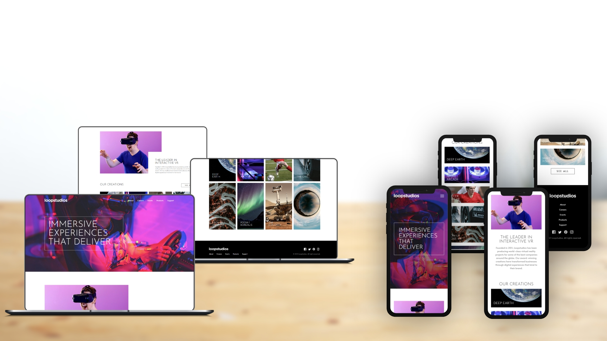

# Loopstudios landing page

This is a solution to the [Loopstudios landing page challenge on Frontend Mentor](https://www.frontendmentor.io/challenges/loopstudios-landing-page-N88J5Onjw). Frontend Mentor challenges help you improve your coding skills by building realistic projects. 

## Table of contents

- [Loopstudios landing page](#loopstudios-landing-page)
  - [Table of contents](#table-of-contents)
  - [Overview](#overview)
    - [The challenge](#the-challenge)
    - [Screenshot](#screenshot)
    - [Links](#links)
  - [Front-end Style Guide](#front-end-style-guide)
    - [Layout](#layout)
    - [Colors](#colors)
    - [Typography](#typography)
    - [Fonts](#fonts)
  - [My process](#my-process)
    - [Built with](#built-with)
  - [Author](#author)

## Overview

### The challenge

Users should be able to:

- View the optimal layout for the site depending on their device's screen size
- See hover states for all interactive elements on the page

### Screenshot

### Links

- Live Site URL: [https://benjaminvillatte.github.io/fem-loopstudios-landing-page/](https://benjaminvillatte.github.io/fem-loopstudios-landing-page/)

## Front-end Style Guide

### Layout

The designs were created to the following widths:

- Mobile: 375px
- Desktop: 1440px

### Colors

- White: hsl(0, 0%, 100%)
- Black: hsl(0, 0%, 0%)
- Dark Gray: hsl(0, 0%, 55%)
- Very Dark Gray: hsl(0, 0%, 41%)

### Typography

- Font size: 15px

### Fonts

- Family: [Alata](https://fonts.google.com/specimen/Alata)
- Weight: 400

- Family: [Josefin Sans](https://fonts.google.com/specimen/Josefin+Sans)
- Weight: 300

## My process

### Built with

- Semantic HTML5 markup
- CSS custom properties
- Flexbox
- CSS Grid
- Mobile-first workflow
- css animations (for menu items in mobile)

## Author

- Website - [Benjamin VILLATTE](https://benjaminvillatte.fr)

